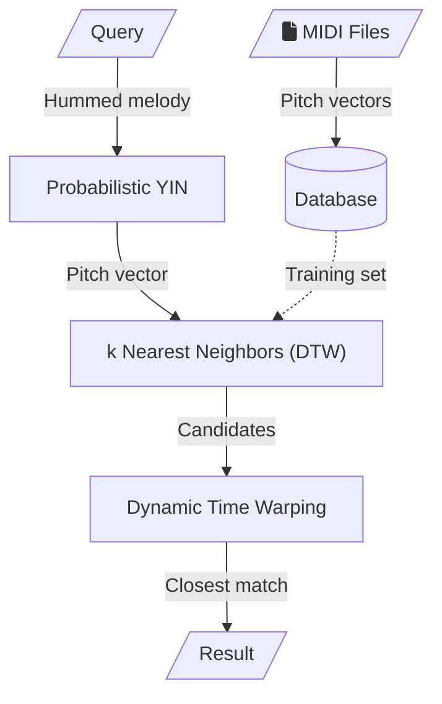

<link href="https://cdnjs.cloudflare.com/ajax/libs/font-awesome/6.5.1/css/all.min.css" rel="stylesheet"/>

# Strawberry fields
Song retrieval using hummed query

## Setup
Clone the Repository.
```bash
git clone https://github.com/vivekvjyn/strawberry-fields.git
cd sound-of-music
```
### Environment setup
Create a virtual environment.
```bash
pip install virtualenv
virtualenv venv
```
Activate the environment.

   **Windows:**
```bash
venv\Scripts\activate
```

   **Linux:**
```bash
source venv/bin/activate
```
Create a `.env` file in the root directory of your project and copy the following into the file.

```makefile
USER=username
PASSWORD=password
SECRET_KEY=secret_key
```
Replace `username`, `password`, and `secret_key` with the username and password of your MongoDB database and the secret key for your Flask app.

### Install Dependencies

Install the required packages using pip with the `requirements.txt` file.

```bash
pip install -r requirements.txt
```

## Usage
### MongoDB Setup

Ensure you have MongoDB installed and running. Create a database named `MusicCatalog` with a collection named `MusicCatalog`.

Run `features.py` to add a song to your database.
```bash
python features.py
```
Enter the requested details and the path to the MIDI file of the song.

Once all the songs are added to the database, run `train.py` to update the model to fit your database.
```bash
python train.py
```

### Run the application

```bash
python -m flask run
```

Go to your localhost server in your web browser and allow microphone access when prompted.
## System Architecture

