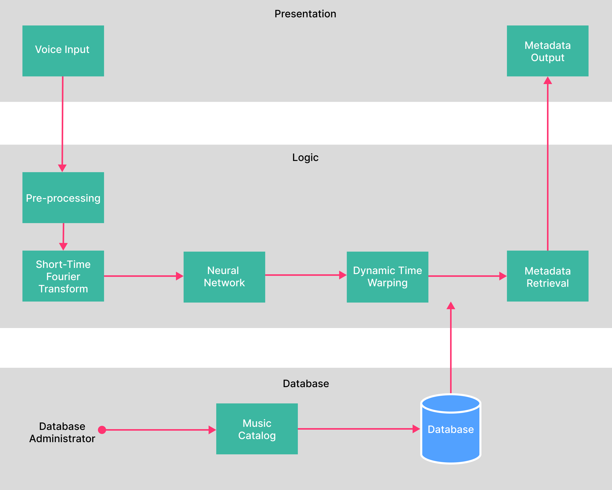

# Strawberry fields
Song retrieval using hummed query

## Usage
After cloning the repository, navigate into the project directory and install the required packages using pip with the `requirements.txt` file.

```bash
pip install -r requirements.txt
```

To run the application, execute the following command:

```bash
python -m flask run
```

Make sure you have Python and Flask installed on your system before running the Flask application.

## System Architecture



## References

- Robert C. Maher, James W. Beauchamp, "Fundamental frequency estimation of musical signals using a two-way mismatch procedure", April 1994.

- Lawrence Rabiner, Jont B. Allen, "Short-Time Fourier Analysis Techniques for FIR System Identification and Power Spectrum Estimation", July 1977.

- Ulrich Oberst, "The Fast Fourier Transform", January 2007.

- Prajoy Podder, Tanvir Zaman Khan, Mamdudul Haque Khan, M. Muktadir Rahman, "Comparative Performance Analysis of Hamming, Hanning and Blackman Window", June 2014.

- Ivan Fernandez Cocano, "Expanding the evaluation of Audio to Score Matching applying Audio Querying strategies", August 2023

- Matija Marolt, "A mid level melody based representation for calculating audio similarity", January 2006

- Joan Serrà,  Josep Ll. Arcos, "An Empirical Evaluation of Similarity Measures for Time Series Classification", Jan 2014

- Pedro Cano,  Eloi Batlle, "A Review of Audio Fingerprinting", November 2005

- Pavel Senin, "Dynamic Time Warping Algorithm Review", January 2009

- Colin Raffel, Daniel P. W. Ellis, "Large-Scale Content-Based Matching of Midi and Audio Files", January 2015.

- Neal Gallagher, "Savitzky-Golay Smoothing and Differentiation Filter", January 2020.

- Hiroaki Sakoe,Seibi Chiba, "Dynamic programming algorithm optimization for spoken word recognition", February 1978.

- Tomasz Górecki, Maciej Łuczak, "The influence of the Sakoe–Chiba band size on time series classification", January 2019.

- Mengru Zhang, "Time Series Search Based on Locality Sensitive Hashing", July 2021.

- Rong Gong, Xavier Serra, "Audio to Score Matching by Combining Phonetic and Duration Information", October 2017.