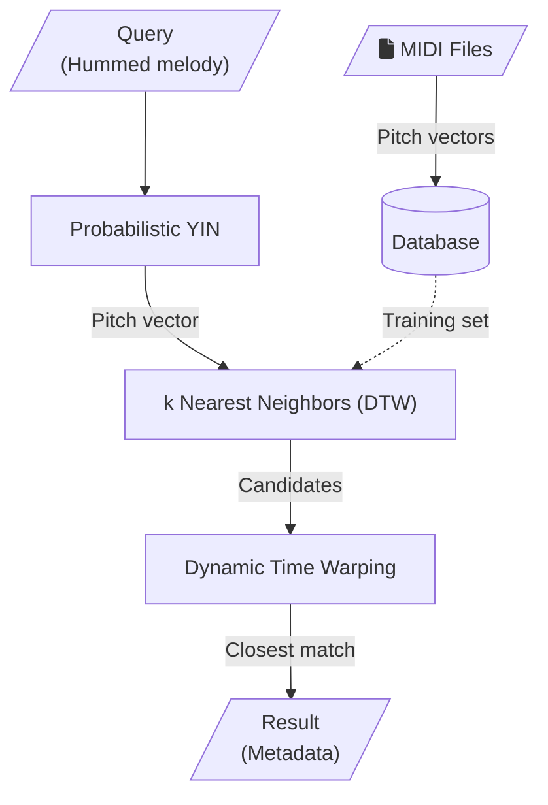

<link href="https://cdnjs.cloudflare.com/ajax/libs/font-awesome/6.5.1/css/all.min.css" rel="stylesheet"/>

# Strawberry fields
Song retrieval using hummed query

## Setup
Clone the Repository.
```bash
git clone https://github.com/enter-opy/strawberry-fields.git
cd sound-of-music
```
### Environment setup
Create a virtual environment.
```bash
pip install virtualenv
virtualenv venv
```
Activate the environment.

   **Windows:**
```bash
venv\Scripts\activate
```

   **Linux:**
```bash
source venv/bin/activate
```
Create a `.env` file in the root directory of your project and copy the following into the file.

```makefile
USER=username
PASSWORD=password
SECRET_KEY=secret_key
```
Replace `username`, `password`, and `secret_key` with the username and password of your MongoDB database and the secret key for your Flask app.

### Install Dependencies

Install the required packages using pip with the `requirements.txt` file.

```bash
pip install -r requirements.txt
```

## Usage
### MongoDB Setup

Ensure you have MongoDB installed and running. Create a database named `MusicCatalog` with a collection named `MusicCatalog`.

Run `features.py` to add a song to your database.
```bash
python features.py
```
Enter the requested details and the path to the MIDI file of the song.

Once all the songs are added to the database, run `train.py` to update the model to fit your database.
```bash
python train.py
```

### Run the application

```bash
python -m flask run
```

Go to your localhost server in your web browser and allow microphone access when prompted.
## System Architecture


## Contributing
Contributions to Strawberry Fields are welcome! If you'd like to contribute, follow these steps:
1. **Fork the Repository:** Start by forking the [Strawberry Fields](https://github.com/enter-opy/strawberry-fields).
2. **Make Changes:** Create a new branch , make your changes, and commit them to your branch.
3. **Create a Pull Request:** Push your changes to your fork and submit a pull request to the original repository.
## License
This project is licensed under the GNU General Public License. See the [LICENSE](https://github.com/enter-opy/strawberry-fields/blob/main/LICENSE) for details.

### References

- Joan Serrà, Josep Ll. Arcos, [*An Empirical Evaluation of Similarity Measures for Time Series Classification*](https://arxiv.org/abs/1401.3973#:~:text=An%20Empirical%20Evaluation%20of%20Similarity%20Measures%20for%20Time%20Series%20Classification,-Joan%20Serr%C3%A0%2C%20Josep&text=Time%20series%20are%20ubiquitous%2C%20and,series%20clustering%20and%20classification%20systems.), Jan 2014.
- Hiroaki Sakoe, Seibi Chiba, [*Dynamic programming algorithm optimization for spoken word recognition*](https://ieeexplore.ieee.org/document/1163055), February 1978.
- Ivan Fernandez Cocano, [*Expanding the evaluation of Audio to Score Matching applying Audio Querying strategies*](https://zenodo.org/records/8380501), August 2023.
- Matthias Mauch and Simon Dixon, [*PYIN: A Fundamental Frequency Estimator Using Probabilistic Threshold Distributions*](https://ieeexplore.ieee.org/document/6853678), May 2014.